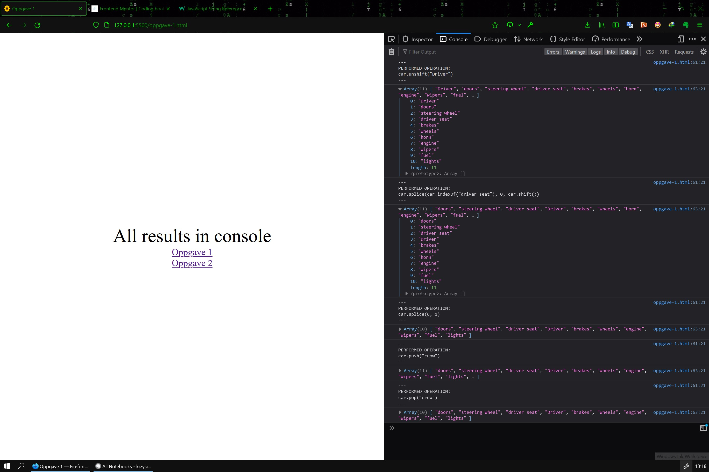
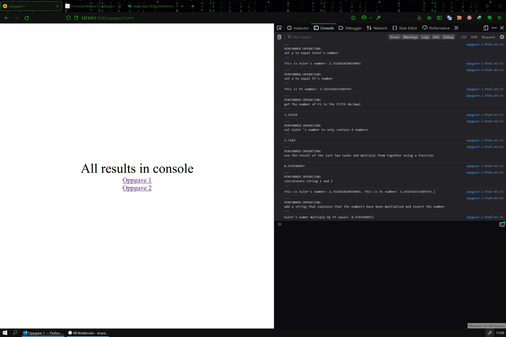

# ARRAY i JavaScript

[Source code](https://github.com/chriskodehub/KH-8_array-i-javascript)  
[Live demo](https://chriskodehub.github.io/KH-8_array-i-javascript/)

## Oppgave 1

1. create an array containing everything a car needs with atleast 10 elements.
2. add a person to the start of the array.
3. remove the person, and add them on top of the driver's seat (the index above the index of the driver's seat).
4. remove the element in position 7.
5. add a crow at the end of the array.
6. remove it again.

## Oppgave 2

Du kan kopiere inn teksten under i VS om du ønsker. Da er det letter å gjøre oppgaven linje for linje. // set x to equal Pi(as large as you can find on internett)

```js
// set y to equal Euler 's number

// set string1 to "this is Euler's number"
// set string2 to "and this is pi"

let x = pi // bruk tallet som du fant på internettet
console.log(x)

// get the number of Pi to the fifth decimal.

// set Euler 's number to only contain 4 numbers.

// use the result of the last two tasks and multiply them together using a
// function.

// concatenate string 1 and 2.

// write a function that puts the numbers in their right position in the new string.

// ad a string that explains that the numbers have been multiplied and insert the number.
```

## Result



